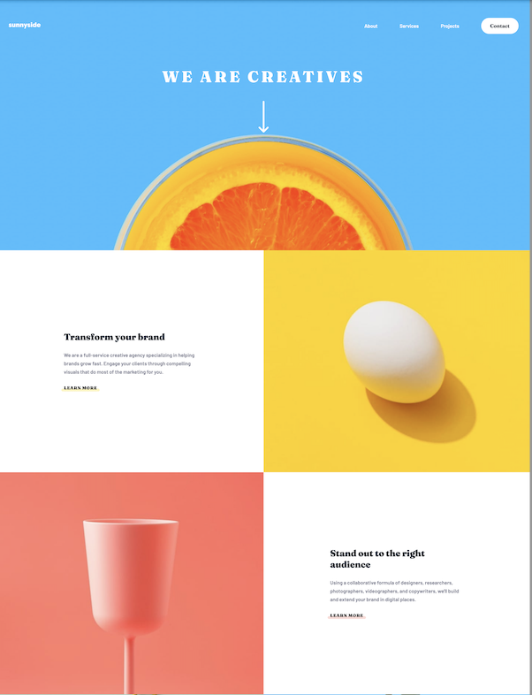

# Sunnyside agency landing page

## Table of contents

- [Overview](#overview)
  - [Screenshots](#screenshots)
  - [Links](#links)
- [My process](#my-process)
  - [Built with](#built-with)
  - [What I learned](#what-i-learned)
- [Author](#author)

### Screenshots

### Links

- Live Demo: <a href="https://akagansunnylandingpage.netlify.app/" target="_blank">Sunnyside Landing Page</a>

## My process

### Built with

- HTML
- CSS
- Flexbox
- CSS Grid
- Mobile-first workflow

### What I learned

This project taught me a lot about:

- Working with CSS Grid in the context of mixing images and text
- Text responsive scalability
- Text overlays on top of images

## Contact

- Portfolio - [aaronkagan.dev](https://www.aaronkagan.dev)
- X - [@aaronkagandev](https://www.twitter.com/aaronkagandev)
- Instagram - [aaronkagandev](https://www.instagram.com/aaronkagandev/)
